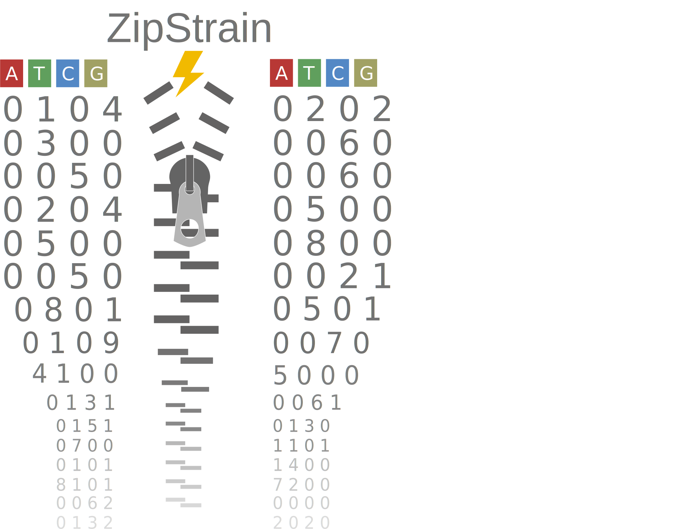
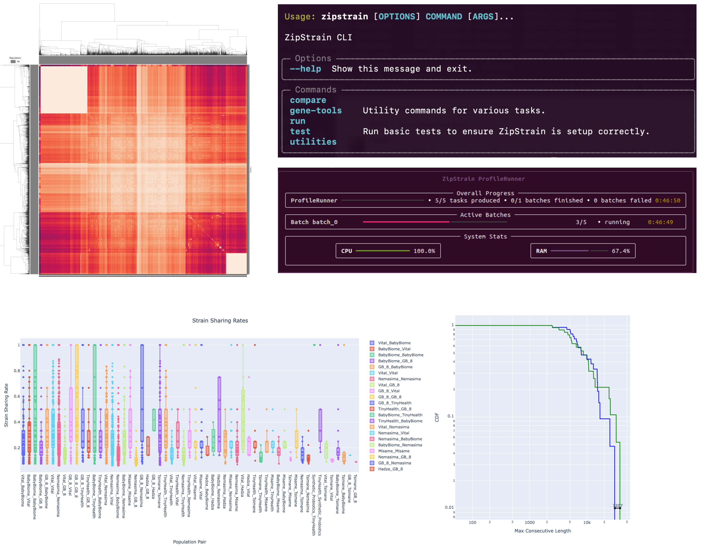

# ZipStrain

Official Repository for ZipStrain python package. ZipStrain is a bioinformatics tool designed for rapid profiling of metagenomic samples as well as comparative analysis of strain-level variations within microbial communities. 




## Quick Start

### Installation

To install ZipStrain using pip, follow these steps:

1- Make sure you have Python 3.12 or higher installed in your Python environment and activate it.

2- Open your terminal and run the following command to install ZipStrain:

```
pip install zipstrain
```

For more information about installation and usage instructions, please refer to the [installation manual](docs/installation.md) or the documentation website [here](https://zipstrain.readthedocs.io/en/latest/).

check installation by:


```
zipstrain test

```

### Profile multiple bam files

You can profile multiple BAM files using either the ZipStrain command-line interface (CLI) or Nextflow Pipeline. Below are examples of both methods.
For both you need to prepare a csv file containing the paths to the bam files to be profiled and the sample names. Example of such a csv file:

```csv
sample_name,bamfile
sample1,/path/to/sample1.bam
sample2,/path/to/sample2.bam
sample3,/path/to/sample3.bam
```

#### ZipStrain CLI

To profile multiple BAM files using the ZipStrain CLI, you should first prepare some files:

```bash
zipstrain run prepare-profiling  --reference-fasta <path/to/reference/fasta> --gene-fasta <path/to/reference/fasta/genes> --stb-file  <path/to/stb/file> --output-dir <directory/to/save/outputs>
```

Your output directory should contain the following files:

-   genomes_bed_file.bed
-   genome_lengths.parquet
-   gene_range_table.tsv

Now you can profile your bam files:

```
zipstrain run profile --input-table <path/to/bam/csv> --stb-file <path/to/stb/file> --gene-range-table <path/to/gene/range> --bed-file <path/to/bed/file> --genome-length-file <path/to/bed/file> --run-dir <path/to/save/generated/files>

```

#### Nextflow Pipeline

To profile multiple BAM files using Nextflow, you can create a Nextflow script as follows:

```

nextflow run zipstrain.nf --mode "fast_profile" --input_table <path/to/bam/csv>  --gene_file <path/to/reference/fasta/genes> --stb <path/to/stb/file>  --output_dir <path/to/save/generated/files> --reference_genome <path/to/reference/fasta> -c conf.config -profile <your/system/specific/profile> -resume

```

**Note**  With the nextflow pipeline, you don't need the preparation step and those will be made along the way.

### Compare multiple profiled samples

To compare multiple profiled samples, you can use either the ZipStrain CLI or the Nextflow Pipeline. Below are examples of both methods.

#### ZipStrain CLI
To compare multiple profiled samples using the ZipStrain CLI, you can use the following command:

```bash
zipstrain run compare blah

```
#### Nextflow Workflow
To compare multiple profiled samples using Nextflow, you can create a Nextflow script as follows
```nextflow
// Nextflow script to compare multiple profiled samples

```

### Downstream Analysis and Visualization

ZipStrain provides a Python API that allows for basic downstream analysis and visualization of the profiling and comparison results. Here's an example of how to use the API for visualization:

```python
import zipstrain as zs  
blah
```

For more detailed examples and documentation, please refer to Tutorials section in the [Documentation](docs/tutorials.md) or visit the documentation website [here](https://zipstrain.readthedocs.io/en/latest/).