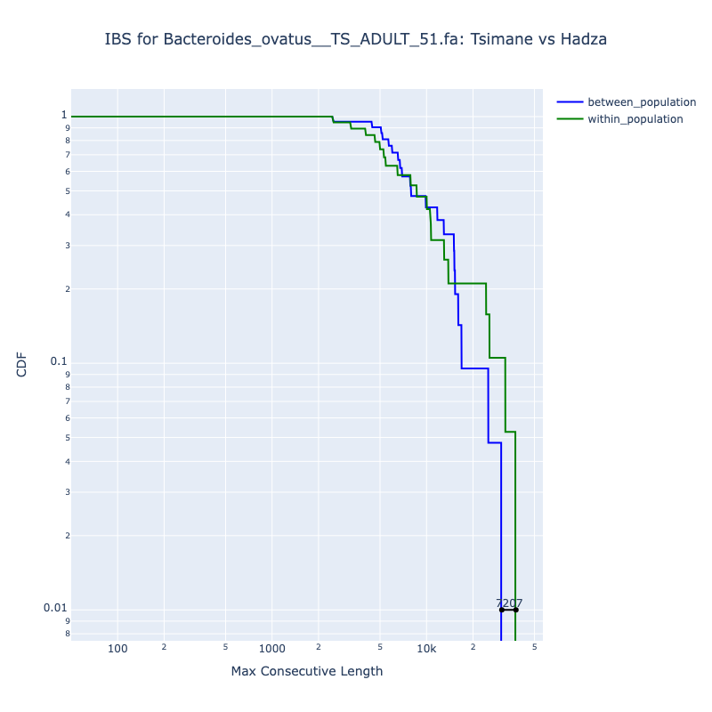

# ZipStrain

Official Repository for ZipStrain python package. ZipStrain is a bioinformatics tool designed for rapid profiling of metagenomic samples as well as comparative analysis of strain-level variations within microbial communities. For a detailed description of the tool, please refer to the documentation website [here](https://OlmLab.github.io/ZipStrain/).


Zipstrain is developed by Parsa Ghadermazi and team at the Olm Lab at University of Colorado Boulder.

## Quick Start

### Installation

To install ZipStrain using pip, follow these steps:

1- Make sure you have Python 3.12 or higher installed in your Python environment and activate it.

2- Open your terminal and run the following command to install ZipStrain:

```
pip install zipstrain
```

For more information about installation and usage instructions, please refer to the [installation manual](docs/installation.md) or the documentation website [here](https://zipstrain.readthedocs.io/en/latest/).

check installation by:


```
zipstrain test

```

----------

### Profile multiple bam files

You can profile multiple BAM files using either the ZipStrain command-line interface (CLI) or Nextflow Pipeline. Below are examples of both methods.
For both you need to prepare a csv file containing the paths to the bam files to be profiled and the sample names. Example of such a csv file:

```csv
sample_name,bamfile
sample1,/path/to/sample1.bam
sample2,/path/to/sample2.bam
sample3,/path/to/sample3.bam
```

#### ZipStrain CLI

To profile multiple BAM files using the ZipStrain CLI, you should first prepare some files:

```bash
zipstrain run prepare-profiling  --reference-fasta <path/to/reference/fasta> --gene-fasta <path/to/reference/fasta/genes> --stb-file  <path/to/stb/file> --output-dir <directory/to/save/outputs>
```

Your output directory should contain the following files:

-   genomes_bed_file.bed
-   genome_lengths.parquet
-   gene_range_table.tsv

Now you can profile your bam files:

```
zipstrain run profile --input-table <path/to/bam/csv> --stb-file <path/to/stb/file> --gene-range-table <path/to/gene/range> --bed-file <path/to/bed/file> --genome-length-file <path/to/bed/file> --run-dir <path/to/save/generated/files>

```


#### Nextflow Pipeline

To profile multiple BAM files using Nextflow, you can create a Nextflow script as follows:

```

nextflow run zipstrain.nf --mode "fast_profile" --input_table <path/to/bam/csv>  --gene_file <path/to/reference/fasta/genes> --stb <path/to/stb/file>  --output_dir <path/to/save/generated/files> --reference_genome <path/to/reference/fasta> -c conf.config -profile <your/system/specific/profile> -resume

```

**Note**  With the nextflow pipeline, you don't need the preparation step and those will be made along the way.

#### Output files

Profiling each sample creates three main files regardless of the execution workflow (ZipStrain CLI or Nextflow):

- ##### profile (sample_name.parquet by default)

    This is a parquet file that has the nucleotide count for each poition on the reference fasta that is covered by at least one base. It is a table with the following columns:
    |chrom|pos|gene|A|T|C|G|
    |-----|---|----|-|-|-|-|

- ##### Breadth (sample_name_breadth.parquet by default)

    This is parquet file that has the fraction of each genome that has been mapped at least min_breadth_cov times. It is a parquet
    file like the follwing:

    |genome|breadth|
    |------|-------|

- ##### Scaffolds (sample_name.parquet.scaffolds by default)

    Just a simple text file that has the name of any scaffold in the reference fasta that has been covered at least by a single base. This might be helpful in the comparison space if you run it in light memory mode

--------------

### Compare genomes in multiple profiled samples 

You can compare multiple profiled samples using either the ZipStrain command-line interface (CLI) or Nextflow Pipeline. Below are examples of both methods. The two approaches are slightly different in terms of input requirements. First let's see how this is done using the ZipStrain CLI.

#### ZipStrain CLI
To compare multiple profiled samples using the ZipStrain CLI, first you need to build a profile database that contains all the profiled samples you want to compare. You can do this by running the following command:

```bash
zipstrain utilities build-profile-db --profile-db-csv <path/to/profiles/csv> --output-db <path/to/save/profile/db>
```
The input CSV file should have the following columns:

    
    - profile_name: An arbitrary name given to the profile (Usually sample name or name of the parquet file)
    
    - profile_location: The location of the profile
    
    - scaffold_location: The location of the scaffold
    
    - reference_db_id: The ID of the reference database. This could be the name or any other identifier for the database that the reads are mapped to.
    
    - gene_db_id: The ID of the gene database in fasta format. This could be the name or any other identifier for the database that the reads are mapped to.

Running this command will perform the necessary checks and if successful, it will create a profile database in parquet format at the specified output location.

Next, You use this profile database build a configuration json file that will be used to calculate the pairs that need to be compared. In this step you need to define the required parameters for comparison such as min_coverage, etc. You can make the configuration file by running the following command:

```bash
zipstrain utilities build-comparison-config \
--profile-db <path/to/profile/db> \
--gene-db-id <gene_db_id_used_in_profile_db> \
--reference-db-id <reference_db_id_used_in_profile_db> \
--scope "all" \
--min-cov 5 \
--min-gene-compare-len 200 \
--null-model-p-value 0.05 \
--stb-file-loc <path/to/stb/file> \
--null-model-loc <path/to/null/model/file> \
--current-comp-table <path/to/current/comparison/table.parquet> \
--output-file <path/to/save/comparison/config.json>
```
Note that providing current-comp-table is optional. If provided, the comparison config will only include pairs that are not already compared in the current comparison table.

Finally, you can run the comparison using the generated configuration file and the profile database:

```bash
zipstrain run compare_genomes \
--genome-comparison-object <path/to/comparison/config.json> \
--run-dir <path/to/save/comparison/outputs> \
--max-concurrent-batches 1
```

This command take some more arguments and for more information about them please refer to the [Tutorial](docs/Tutorial.md).


#### Nextflow Workflow

There are two ways you can run the comparison workflow in ZipStrain Nextflow pipeline. 

1- I have a comparison config file already made using the ZipStrain CLI as explained above.

In this case you obtain a table of remaining pairs to be compared from the comparison config file and run the comparison as follows:

```
zipstrain utilities to-complete-table --genome-comparison-object <path/to/comparison/config.json> --output-file <path/to/output/remaining_pairs.csv>
```

Then you can run the comparison using the following command:

```
nextflow run zipstrain.nf --mode fast_compare \
 --input_table <path/to/output/remaining_pairs.csv> \
 --input_type "pair_table" --gene_file <path/to/gene/fasta/file> \
 --reference_genome <path/to/reference/genome.fasta> \  
 --stb <path/to/stb/file.stb> -c conf.config \
 --output_dir "<path/to/output/directory>" \
 --compare_genome_scope "all" \
 --compare_memory_mode "heavy" \
 --parallel_mode "batched" \
 --batch_size 2000 -profile <profile_name> \
 --batch_compare_n_parallel 3 -qs 200 -resume
```

2- I don't have a comparison config file and I want to run the comparison directly from the profile lists.

In this case, the nextflow pipeline will run all non-redundant pairwise comparisons between the provided profiles. Here is an example command:

```
nextflow run zipstrain.nf --mode fast_compare \
 --input_table <path/to/profiles/csv> \
 --input_type "profile_table" --gene_file <path/to/gene/fasta/file> \
 --reference_genome <path/to/reference/genome.fasta> \
 --stb <path/to/stb/file.stb> -c conf.config \
 --output_dir "<path/to/output/directory>" \
 --compare_genome_scope "all" \
 --compare_memory_mode "heavy" \
 --parallel_mode "batched" \
 --batch_size 2000 -profile <profile_name> \
 --batch_compare_n_parallel 3 -qs 200 -resume
```

For more information, refer to the [Nextflow Pipeline Documentation](./NextflowPipeline.md).

#### Output files

Regardless of the execution workflow (ZipStrain CLI or Nextflow), comparing profiles yields a single table "merged_comparison.parquet" that contains the comparison results for all compared profile pairs. The table has the following columns:

|genome|total_positions|share_allele_pos|genome_pop_ani|max_consecutive_length|shared_genes_count|identical_gene_count|perc_id_genes|sample_1|sample_2|
|-----|---------------|----------------|--------------|---------------------|------------------|--------------------|-------------|--------|--------|

For more information about the columns, please refer to the [Tutorial](docs/Tutorial.md).

### Downstream Analysis

ZipStrain offers visualization module that allows you to perform statistical analyses on the comparison results and visualize them. All of the functionalities require the merged comparison table made in the last step. Here we list the available functionalities in the visualization module and provide links to their respective documentation pages for more details:

- [Strain Sharing Analysis](docs/Visualization/StrainSharing.md)
  Strain sharing analysis helps identify strains that are shared between different samples based on the comparison results. This analysis can provide insights into the transmission and distribution of strains across different environments or hosts.

  

- [Genome Similarity Analysis](docs/Visualization/GenomeSimilarity.md)
    You can build clustermaps and dendograms based on ANI calculated for any genome that exists in your comparison results.

    


- [Evolutionary Analysis](docs/Visualization/EvolutionaryAnalysis.md)
    You can perform evolutionary analysis on any genome that exists in your comparison results. This includes comparing the distribution of longest identical tracts for within and between two populations.

    