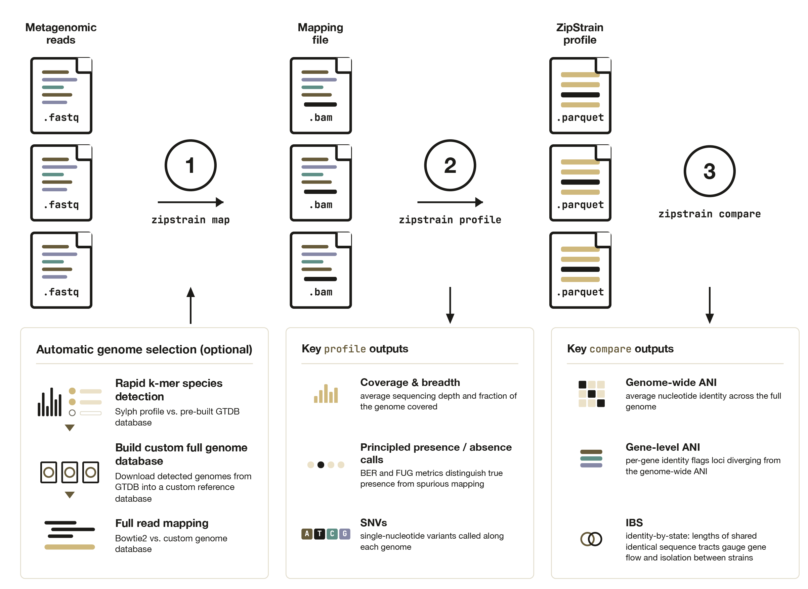

# ZipStrain

<table>
  <tr>
    <td>
      <p><strong>Strain-resolution metagenomics at scale.</strong></p>
      <p>
        ZipStrain is a Python package specializing in strain-level metagenomic analysis. It profiles mapped reads into per-position nucleotide counts and compares
        metagenomic samples at genome and gene scope. ZipStrain is designed for large datasets, with an accompanying nextflow pipeline (See the documentation - https://olmlab.github.io/ZipStrain)
      </p>
      <p>
        <a href="https://OlmLab.github.io/ZipStrain/"></a>
        <a href="https://github.com/OlmLab/ZipStrain/actions/workflows/pr-tests.yml"></a>
        <a href="https://anaconda.org/bioconda/zipstrain"></a>
        <a href="https://hub.docker.com/r/parsaghadermazi/zipstrain"></a>
        <a href="https://codecov.io/gh/OlmLab/ZipStrain?branch=main"></a>
        
      </p>
    </td>
    <td align="center" valign="middle">
      
    </td>
  </tr>
</table>

Developed by Parsa Ghadermazi and the [Olm Lab](https://www.colorado.edu/lab/olm/), University of Colorado Boulder.

**Strain-level metagenomics in three commands:** ZipStrain maps reads, profiles them at single-nucleotide resolution, and compares samples by ANI to tell whether they share a strain.


## Documentation

Full documentation available at [https://olmlab.github.io/ZipStrain/](https://olmlab.github.io/ZipStrain/)

## Install

```bash
# Conda (recommended — bundles samtools and the map aligners)
conda create -n zipstrain -c conda-forge -c bioconda python=3.12 zipstrain bowtie2 samtools sylph
conda activate zipstrain
zipstrain test
```

Prefer pip? `pip install zipstrain` (then install `samtools` separately). Full options: [Installation](https://olmlab.github.io/ZipStrain/installation/).

## The three commands



### 1. `map` — reads → BAMs

Aligns reads to a reference and writes sorted BAMs plus a `samples.txt` ready for profiling. Omit `--reference-fasta` to let Sylph pick and build a reference automatically. Resumable if interrupted.

```bash
zipstrain map -i reads.csv -o mapped \
  --reference-fasta ref.fna --stb-file ref.stb
```


### 2. `profile` — BAMs → nucleotide profiles

Counts A/C/G/T at every reference position and writes per-genome stats (coverage, breadth, a present/absent call) and SNVs. Missing assets are auto-generated and cached.

```bash
zipstrain profile -i mapped/samples.txt -f ref.fna -s ref.stb -r profiled
```


### 3. `compare` — profiles → ANI

Compares every pair of samples by popANI (near 100% ⇒ same strain). Point `--profile-db` at a CSV of `profile_name,profile_location`.

```bash
zipstrain compare --profile-db profiles.csv -r compared
```


Every run writes a `zipstrain_run.log` so you can tell if it is running, finished, or crashed. Prefer a pipeline? A [Nextflow implementation](https://olmlab.github.io/ZipStrain/usermanual/#nextflow-implementation) runs all of this end to end.

## Citation

If you use ZipStrain in your research, please cite the preprint:

Ghadermazi P, Emerson JB, Olm MR. 2026. *ZipStrain Enables Rapid and Precise
Strain-Resolved Metagenomics*. bioRxiv. [https://doi.org/10.64898/2026.05.20.726564](https://doi.org/10.64898/2026.05.20.726564)

GitHub can also expose the citation metadata directly from
[CITATION.cff](CITATION.cff).

## License

ZipStrain is distributed under the terms described in [LICENSE](LICENSE).
