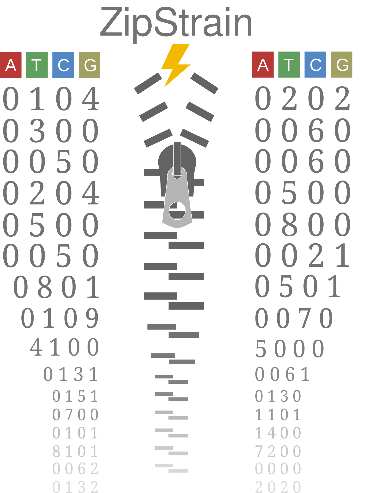

# ZipStrain

ZipStrain is a strain-resolution metagenomics toolkit for:

- profiling mapped reads into per-position nucleotide counts
- comparing profiles at genome and gene levels
- running large profiling/comparison jobs in local or Slurm batch mode
- building local reference-genome databases from abundance outputs (currently Sylph)

Official docs: [https://OlmLab.github.io/ZipStrain/](https://OlmLab.github.io/ZipStrain/)



ZipStrain is developed by Parsa Ghadermazi and team at the Olm Lab, University of Colorado Boulder.

## Installation

```bash
pip install zipstrain
zipstrain test
```

Detailed setup: [docs/installation.md](docs/installation.md)

## ZipStrain-Light (new)

`zipstrain-light` is a separate CLI that keeps the existing `zipstrain` behavior unchanged.

- Profile output is engine-specific:
  - `--engine duckdb`: profile directory contains one `profile.duckdb`
  - `--engine polars`: profile directory contains `coverage.parquet` and `snp.parquet`
- Compare uses shared covered positions plus SNP-disjoint positions to compute the same genome-level outputs as regular ZipStrain (`popani` mode).

Example:

```bash
zipstrain-light profile \
  --profile-parquet sample_profile.parquet \
  --reference-fasta reference_genomes.fna \
  --engine duckdb \
  --min-cov 5 \
  --output-dir sampleA.light_profile

zipstrain-light compare \
  --profile-1 sampleA.light_profile \
  --profile-2 sampleB.light_profile \
  --stb-file reference_genomes.stb \
  --output-file sampleA_sampleB_comparison.parquet
```

`zipstrain-light compare` supports `--engine duckdb|polars` (default `duckdb`).
It requires `--stb-file` (zipstrain-compatible compare behavior).
It also supports modular metric selection via `--calculate` (default `all`; examples: `ani`, `ani+ibs`, `all`).

If `zipstrain-light` is not found after updating source code, reinstall package entry points (for example `pip install -e .` in the `zipstrain/` project directory).

`zipstrain utilities profile-single` now separates chunking from concurrency:
- `--num-chunks` controls how many BED chunks are created (default `24`)
- `--max-concurrency` controls how many chunks run at once (default `4`)

## Quick Start (Current CLI)

### 1. Prepare profiling assets

```bash
zipstrain utilities prepare_profiling \
  --reference-fasta <reference.fasta> \
  --gene-fasta <genes.fna> \
  --stb-file <mapping.stb> \
  --output-dir <profiling_assets_dir>
```

This creates:

- `genomes_bed_file.bed`
- `gene_range_table.tsv`
- `genome_lengths.parquet`

### 2. Profile multiple BAM files

Input CSV:

```csv
sample_name,bamfile
sample1,/path/to/sample1.bam
sample2,/path/to/sample2.bam
```

Run profiling:

```bash
zipstrain profile \
  --input-table <samples.csv> \
  --stb-file <mapping.stb> \
  --null-model <null_model.parquet> \
  --gene-range-table <profiling_assets_dir/gene_range_table.tsv> \
  --bed-file <profiling_assets_dir/genomes_bed_file.bed> \
  --genome-length-file <profiling_assets_dir/genome_lengths.parquet> \
  --run-dir <profile_run_dir>
```

Optional execution controls:

- `--execution-mode local|slurm`
- `--slurm-config <slurm.json>` (required when `--execution-mode slurm`)
- `--container-engine local|docker|apptainer`
- `--num-procs`, `--task-per-batch`, `--max-concurrent-batches`, `--poll-interval`

### 3. Build a profile database for comparisons

Input CSV columns (required):

- `profile_name`
- `profile_location`
- `reference_db_id`
- `gene_db_id`

```bash
zipstrain utilities build-profile-db \
  --profile-db-csv <profiles.csv> \
  --output-file <profile_db.parquet>
```

### 4. Build comparison config objects

`null_model` settings are not required anymore for comparison config objects. Legacy null-model keys in older JSON files are ignored for backward compatibility.

Genome comparison config:

```bash
zipstrain utilities build-genome-comparison-config \
  --profile-db <profile_db.parquet> \
  --gene-db-id <gene_db_id> \
  --reference-genome-id <reference_id> \
  --scope all \
  --min-cov 5 \
  --min-gene-compare-len 200 \
  --stb-file-loc <mapping.stb> \
  --output-file <genome_compare.json>
```

Gene comparison config:

```bash
zipstrain utilities build-gene-comparison-config \
  --profile-db <profile_db.parquet> \
  --gene-db-id <gene_db_id> \
  --reference-genome-id <reference_id> \
  --scope all:all \
  --min-cov 5 \
  --min-gene-compare-len 200 \
  --stb-file-loc <mapping.stb> \
  --output-file <gene_compare.json>
```

### 5. Run batch comparisons

Genome comparisons:

```bash
zipstrain compare genomes \
  --genome-comparison-object <genome_compare.json> \
  --run-dir <compare_run_dir> \
  --calculate ani \
  --ani-method popani \
  --engine polars \
  --calculate ani+ibs+identical_genes \
  --duckdb-memory-limit 4GB \
  --duckdb-threads 8
```

Gene comparisons:

```bash
zipstrain compare genes \
  --gene-comparison-object <gene_compare.json> \
  --run-dir <gene_compare_run_dir> \
  --engine duckdb \
  --ani-method popani \
  --duckdb-memory-limit 4GB \
  --duckdb-threads 8
```

Notes:

- `--engine` supports `polars` or `duckdb`.
- `--calculate` controls genome metrics: `ani`, `ibs`, `identical_genes` (`all` supported). Default is `all`.
- In scoped comparisons (`--genome` or `--scope` not `all`), the polars path uses DuckDB prefiltering first.
- `--duckdb-memory-limit` and `--duckdb-threads` are available in both single and batch compare interfaces.

### 6. Single pair compare (optional)

Genome-level single compare:

```bash
zipstrain utilities single_compare_genome \
  --mpileup-contig-1 <sampleA_profile.parquet> \
  --mpileup-contig-2 <sampleB_profile.parquet> \
  --stb-file <mapping.stb> \
  --genome all \
  --calculate ani+ibs+identical_genes \
  --engine duckdb \
  --duckdb-memory-limit 2GB \
  --duckdb-threads 8 \
  --duckdb-temp-directory /tmp \
  --output-file <sampleA_sampleB_comparison.parquet>
```

Gene-level single compare:

```bash
zipstrain utilities single_compare_gene \
  --mpileup-contig-1 <sampleA_profile.parquet> \
  --mpileup-contig-2 <sampleB_profile.parquet> \
  --stb-file <mapping.stb> \
  --scope all:all \
  --engine polars \
  --output-file <sampleA_sampleB_gene_comparison.parquet>
```

## Current Output Files

### Profiling outputs

Each profile task produces:

- `<sample_name>.parquet`
- `<sample_name>_genome_stats.parquet`
- `<sample_name>_gene_stats.parquet`

For `zipstrain profile`, these files are written inside task directories under `<run_dir>/batch_*/<sample_name>/`.

`<sample_name>.parquet` columns:

- `chrom`, `genome`, `gene`, `pos`, `A`, `C`, `G`, `T`

Rows are sorted by `genome`, `chrom`, `pos` ascending.

`<sample_name>_genome_stats.parquet` columns:

- `genome`
- `coverage`
- `breadth`
- `genome_length`
- `gap_mean`
- `gap_std`
- `5x_cov_sites`
- `heterogeneity`
- `ber`
- `fug`
- `reads_mapped`

`<sample_name>_gene_stats.parquet` columns:

- `genome`
- `gene`
- `length`
- `breadth`
- `coverage`

### Genome comparison outputs

Batch runs write final merged results to:

- `<run_dir>/Outputs/all_comparisons.parquet`

Columns:

- Always: `genome`, `sample_1`, `sample_2`
- If `ani` requested: `total_positions`, `share_allele_pos`, `genome_pop_ani`
- If `ibs` requested: `max_consecutive_length`
- If `identical_genes` requested: `shared_genes_count`, `identical_gene_count`, `perc_id_genes`

### Gene comparison outputs

Batch runs write final merged results to:

- `<run_dir>/Outputs/all_gene_comparisons.parquet`

Columns:

- `genome`
- `gene`
- `total_positions`
- `share_allele_pos`
- `ani`
- `sample_1`
- `sample_2`

## Run Directory Layout (Batch Runners)

Comparison runners create structured run directories. Typical files include:

- `<run_dir>/batch_events.log` (global progress/event log)
- `<run_dir>/batch_*/batch.log` (per-batch log)
- `<run_dir>/Outputs/all_comparisons.parquet` or `<run_dir>/Outputs/all_gene_comparisons.parquet`

## Build Reference FASTA/STB from Abundances

```bash
zipstrain utilities build-genome-db \
  --tool sylph \
  --abundance-table <sylph_abundance.csv> \
  --cache-dir <genome_cache_dir> \
  --output-dir <reference_output_dir> \
  --download-retries 3 \
  --retry-backoff-seconds 1.0 \
  --download-workers 4
```

This writes:

- `<reference_output_dir>/reference_genomes.fna`
- `<reference_output_dir>/reference_genomes.stb`
- `<reference_output_dir>/genome_db_build_report.txt` (includes failed accession IDs, if any)

The cache directory stores downloaded genomes and reuses existing files across runs.
Only genomes with non-zero abundance in at least one sample are included.
For Sylph input, accessions are read from the `Genome_file` column (GTDB path versions supported).
If `Genome_file` paths are local, they are cached directly before any download fallback.

Detailed walkthrough: [docs/GenomeDBFromSylph.md](docs/GenomeDBFromSylph.md)

## Nextflow

Nextflow workflow documentation:

- [docs/NextflowPipeline.md](docs/NextflowPipeline.md)

Pipeline entrypoint in this repository:

- `zipstrain.nf`

## Additional Documentation

- CLI reference: [docs/cli.md](docs/cli.md)
- End-to-end tutorial: [docs/Tutorial.md](docs/Tutorial.md)
- API notes: [docs/api.md](docs/api.md)
