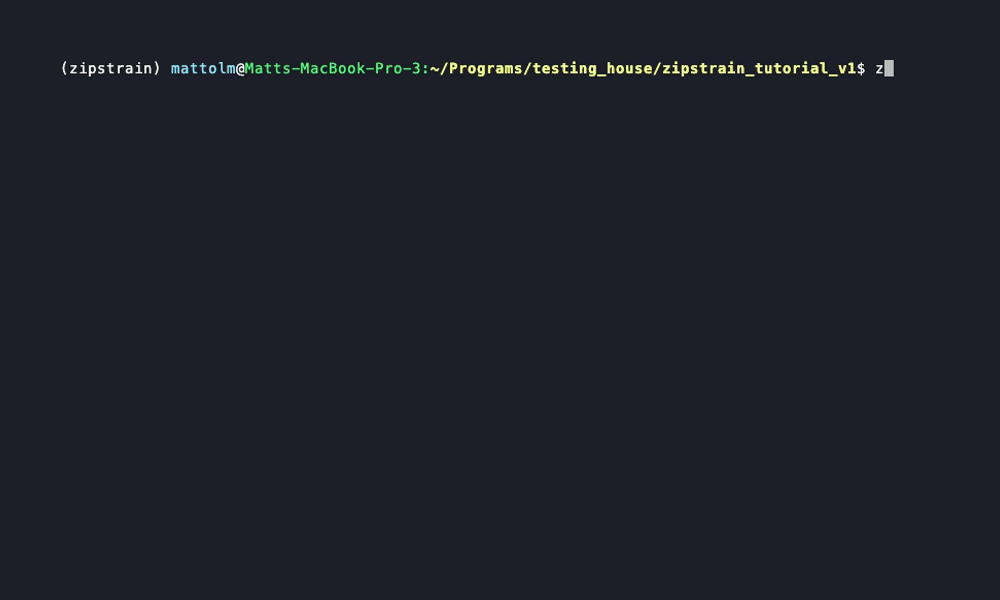

# Tutorial

ZipStrain is designed to be flexible and can be run in a wide variety of ways. The three main decision points are:

| Decision | Option A | Option B |
|----------|----------|----------|
| **Execution** | Python command line interface (CLI) | Nextflow pipeline |
| **Reads** | Local reads (self-sequenced) | Public reads (SRA) |
| **Genome database** | Local genomes | Auto-built from public databases |

These three decisions can be mixed and matched in any combination. The tutorials below cover the most common use cases.

---

## Tutorial #1 — Python CLI with local reads

The following tutorial goes through an example run of ZipStrain using the Python CLI. You can follow along with your own data, or use a small set of test reads included in the inStrain source code.

### Step 1 — Download test data

Download the test files:

```bash
curl -L -O https://raw.githubusercontent.com/MrOlm/inStrain/master/test/test_data/N5_271_010G1.R1.fastq.gz
curl -L -O https://raw.githubusercontent.com/MrOlm/inStrain/master/test/test_data/N5_271_010G1.R2.fastq.gz
curl -L -O https://raw.githubusercontent.com/MrOlm/inStrain/master/test/test_data/N5_271_010G1_scaffold_min1000.fa
curl -L -O https://raw.githubusercontent.com/MrOlm/inStrain/master/test/test_data/N5_271_010G1.maxbin2.stb
curl -L -O https://raw.githubusercontent.com/MrOlm/inStrain/master/test/test_data/N5_271_010G1_scaffold_min1000.fa-vs-N5_271_010G2.sorted.bam
```

Or browse and download them manually from [GitHub](https://github.com/MrOlm/inStrain/tree/master/test/test_data).

| File | Description |
|------|-------------|
| `N5_271_010G1.R1.fastq.gz` | Forward metagenomic reads |
| `N5_271_010G1.R2.fastq.gz` | Reverse metagenomic reads |
| `N5_271_010G1_scaffold_min1000.fa` | Reference genome FASTA (from metagenomic assembly) |
| `N5_271_010G1.maxbin2.stb` | Scaffold-to-bin (STB) file mapping scaffolds to genomes |
| `N5_271_010G1_scaffold_min1000.fa-vs-N5_271_010G2.sorted.bam` | Pre-made BAM file for a second sample |

!!! info "About this sample"
    These reads come from a premature infant fecal sample.

---

### Step 2 — Map reads to make BAM files

`zipstrain map` turns reads into sorted, indexed BAMs in one step (indexing, mapping, sorting, and BAM indexing) and writes a `samples.txt` table ready for profiling. There are two ways to choose the reference to map against — pick the one that fits your data.

!!! warning "Dependencies"
    `zipstrain map` shells out to `bowtie2` and `samtools` (and `sylph`/`prodigal` for the auto-reference and `--predict-genes` options). Install them with `conda install -c bioconda bowtie2 samtools sylph`.

First make a reads table listing each sample and its FASTQ(s):

```bash
printf 'sample_name,reads1,reads2\nN5_271_010G1,N5_271_010G1.R1.fastq.gz,N5_271_010G1.R2.fastq.gz\n' > reads.csv
```

#### Option A — Map to a local reference genome

Use this when you already have a reference FASTA and its STB (as in this tutorial). Pass them with `--reference-fasta` and `--stb-file`:

```bash
zipstrain map \
    --reads-table reads.csv \
    --output-dir mapped \
    --reference-fasta N5_271_010G1_scaffold_min1000.fa \
    --stb-file N5_271_010G1.maxbin2.stb \
    --threads 6
```

#### Option B — Let Sylph pick the reference automatically

Use this when you don't have a reference. Omit `--reference-fasta`, and `zipstrain map` runs [Sylph](https://github.com/bluenote-1577/sylph) to detect which genomes are present in your reads, downloads and caches them, and builds the reference for you:

```bash
zipstrain map \
    --reads-table reads.csv \
    --output-dir mapped \
    --sylph-db /path/to/gtdb-r220-c200-dbv1.syldb \
    --genome-cache-dir genome_cache \
    --threads 6
```

The Sylph database is downloaded to `--sylph-db` automatically if that path does not yet exist (it is ~14 GB, so the first run takes a while), and the detected genomes are cached in `--genome-cache-dir` and reused across runs.

!!! warning "Sylph needs deep reads"
    The Sylph route only works when the reads are deep enough for Sylph to confidently detect genomes. **The tiny scaffold test data used in this tutorial is too shallow**, so Option B will report "no genomes detected" on it — use Option A for the tutorial. To try Option B, use a real metagenome such as the paired reads `SRR31884549_1.fastq` / `SRR31884549_2.fastq`.

??? example "What the Sylph route looks like on a real metagenome"
    `zipstrain map` reports each step as it runs and prints a summary when finished:

    ```text
    ╭───────────────╮
    │ ZipStrain map │
    ╰───────────────╯
    › [1] Read 1 sample(s) from the reads table
    › [2] Sylph profiling SRR31884549 (1/1)
    › [3] Building reference from Sylph abundances (downloading genomes as needed)
    › [4] Building Bowtie2 index
    › [5] Mapping SRR31884549 (1/1)
    ╭────────────────── Summary ──────────────────╮
    │ Mapping complete!                            │
    │ Elapsed: 0:14:37                             │
    │ Output:    .../mapped_sylph                  │
    │ Reference: .../mapped_sylph/reference_genomes.fna
    │ STB:       .../mapped_sylph/reference_genomes.stb
    │ Samples:   .../mapped_sylph/samples.txt      │
    │ Next:      zipstrain profile ...             │
    ╰──────────────────────────────────────────────╯
    ```

    The first run is slow: Sylph loads the ~13 GB database into memory and the detected genomes are downloaded into `--genome-cache-dir`. Both are reused on later runs, so subsequent samples map much faster.

    !!! note "Interleaved reads"
        If your reads come as a single interleaved FASTQ (mates alternating), split them into `_1`/`_2` files first — e.g. with `seqkit split2 -p 2` or `awk`/`samtools` deinterleaving — before building the reads table.

#### Result

Either option writes `mapped/N5_271_010G1.bam` (sorted + indexed), the reference FASTA/STB, and `mapped/samples.txt` — a `sample_name,bamfile` table. This tutorial also profiles a second, pre-mapped sample, so append it to that table:

```bash
printf 'N5_271_010G2,N5_271_010G1_scaffold_min1000.fa-vs-N5_271_010G2.sorted.bam\n' >> mapped/samples.txt
```

The samples table now looks like this:

```text
sample_name,bamfile
N5_271_010G1,/abs/path/mapped/N5_271_010G1.bam
N5_271_010G2,N5_271_010G1_scaffold_min1000.fa-vs-N5_271_010G2.sorted.bam
```

---

### Step 3 — Profile the BAM files

`zipstrain profile` needs only the BAM table from Step 2, the reference FASTA, and the STB file. Any intermediate assets (null model, bed file, genome length table, profiling contract) are generated automatically into a `profiling_assets/` folder inside the run directory and reused on later runs:

```bash
zipstrain profile \
    --input-table mapped/samples.txt \
    --reference-fasta N5_271_010G1_scaffold_min1000.fa \
    --stb-file N5_271_010G1.maxbin2.stb \
    --run-dir out_profile
```



Profiling walks every mapped read at nucleotide resolution and, for each position, counts the A/T/C/G bases observed. A per-sample null model (built automatically from the error rate) decides which minority alleles are real variants versus sequencing noise. The result is one profile per sample plus genome- and gene-level summary statistics.

After a successful run the output directory is organized like this:

```text
out_profile/
├── N5_271_010G1/                      # one folder per sample
│   ├── N5_271_010G1_profile.parquet       # per-position base counts (the core output)
│   ├── N5_271_010G1_genome_stats.parquet  # per-genome coverage, breadth, ANI to reference
│   ├── N5_271_010G1_gene_stats.parquet    # per-gene coverage and breadth
│   └── intermediate_files/                # symlinks, logs, scratch — safe to ignore
├── N5_271_010G2/
│   └── ...
└── profiling_assets/                  # auto-generated null model, bed, contract + run logs
    └── log/
```

The three `*.parquet` files at the top of each sample folder are the real outputs; everything else is bookkeeping. Have a quick look at the genome stats:

```bash
python -c "import polars as pl; print(pl.read_parquet('out_profile/N5_271_010G1/N5_271_010G1_genome_stats.parquet'))"
```

!!! tip "Gene profiling and tuning"
    Pass `--gene-fasta` to enable gene-level profiling, or the null-model options (`--error-rate`, `--max-total-reads`, `--p-threshold`) to tune SNV calling. Use `--force-prepare` to rebuild the cached assets. Run `zipstrain profile -h` to see all options grouped by category.

??? note "Preparing assets separately (advanced / cluster use)"
    You can still build the intermediate files ahead of time with `zipstrain utilities prepare_profiling` and pass them in explicitly via `--null-model`, `--bed-file`, `--genome-length-file`, etc. This is useful on clusters where you prepare once and profile many BAMs across nodes, and it is the path the Nextflow pipeline uses internally.

    ```bash
    zipstrain utilities prepare_profiling \
        --reference-fasta N5_271_010G1_scaffold_min1000.fa \
        -s N5_271_010G1.maxbin2.stb \
        -o profile_prep
    ```

---

### Step 4 — Compare

The comparison step asks, for every genome present in two samples, *how similar are the strains?* It walks each shared genome position by position and computes a population-level ANI (popANI) between the two samples.

First, make a small table telling ZipStrain which profiles to compare and what to call them. The two columns are `profile_name` (any label) and `profile_location` (the path to that sample's `*_profile.parquet` from Step 2):

```bash
printf 'profile_name,profile_location\nN5_271_010G1,out_profile/N5_271_010G1/N5_271_010G1_profile.parquet\nN5_271_010G2,out_profile/N5_271_010G2/N5_271_010G2_profile.parquet\n' > profiles.csv
```

Then run the comparison. You can hand `--profile-db` this CSV directly — there is no separate database-building step:

```bash
zipstrain compare \
    --profile-db profiles.csv \
    --stb-file N5_271_010G1.maxbin2.stb \
    --run-dir out_compare
```

That's the whole command. By default it compares **genomes**; every profile in the table is compared against every other (all-vs-all).

!!! tip "Comparing genes instead"
    Add `--compare-genes` to the same command to compare at the gene level instead of the genome level. Other useful flags: `--min-cov` (minimum coverage to consider a position), `--ani-method` (`popani`, `conani`, `cosani_<t>`), and `--calculate` (trim to just `ani` for a smaller table). Run `zipstrain compare -h` for the full, grouped list.

#### Two comparison methods

`zipstrain compare` has two engines, chosen with `--method`. They compute the **same numbers** and write the **same `all_comparisons.parquet`** — they differ only in *how* they get there, which changes how well each scales to repeated, growing analyses. Here's what each does under the hood.

**Standard (`--method standard`, the default)** compares profiles **directly and pairwise**. For each pair of samples it reads their two profile parquets, walks the positions they share on each genome, and tallies matching vs. differing alleles to get popANI. Nothing is kept between pairs — every comparison is computed fresh from the profiles. This makes it simple and dependency-light, and it shines when you have many genomes but only need a bounded number of comparisons or a one-off run.

**Matrix (`--method matrix`)** first turns your profiles into a **matrix store**: for each genome, one dense `samples × positions × 4` array of base counts (built once, saved as HDF5 in `intermediate_files/`). The comparison then becomes vectorized array math over that store — all-vs-all in one sweep — which can run on a **GPU** (`--backend torch-mps` on Apple Silicon, `--backend torch-cuda` on NVIDIA). It records completed pairs in a resumable DuckDB, so it never redoes work, and new samples can be **appended** to the store without rebuilding it. That reusable, appendable substrate is the whole point: it pays a one-time build cost so that repeated all-vs-all comparisons — especially focused on one genome or a small set, over a cohort that keeps growing — stay fast. It needs the matrix extra (`pip install "zipstrain[matrix]"`).

| | Standard | Matrix |
|---|----------|--------|
| **How it compares** | Direct, pairwise from profiles | Vectorized math over a prebuilt matrix store |
| **Persistent artifact** | None (recomputes each run) | Reusable HDF5 store + resumable compare DB |
| **Best for** | Many genomes, bounded comparisons, one-off | Repeated all-vs-all, few genomes, growing cohorts |
| **Hardware** | CPU | CPU or GPU (`--backend torch-*`) |
| **Extra dependency** | none | `zipstrain[matrix]` (h5py, torch) |

Both are invoked the same way — just add `--method matrix` to switch:

=== "Standard (default)"

    ```bash
    zipstrain compare \
        --profile-db profiles.csv \
        --stb-file N5_271_010G1.maxbin2.stb \
        --run-dir out_compare
    ```

=== "Matrix"

    ```bash
    zipstrain compare \
        --profile-db profiles.csv \
        --method matrix \
        --stb-file N5_271_010G1.maxbin2.stb \
        --run-dir out_compare
    ```

    The matrix store and its resumable compare database are kept in `out_compare/intermediate_files/` and reused on later runs. The bed file the store needs is auto-discovered from the `profiling_assets/` folder created during profiling; pass `--bed-file` if it can't be found.

#### Adding more samples later

You don't rebuild a comparison from scratch when new samples arrive. Point `--run-dir` at the existing run and give a profiles table that now includes the new samples — ZipStrain figures out what's new and computes only the new pairs, then rewrites `all_comparisons.parquet` with the full result:

```bash
# profiles_more.csv lists the original samples plus a new one
printf 'profile_name,profile_location\nN5_271_010G1,out_profile/N5_271_010G1/N5_271_010G1_profile.parquet\nN5_271_010G2,out_profile/N5_271_010G2/N5_271_010G2_profile.parquet\nN5_271_010G3,out_profile/N5_271_010G3/N5_271_010G3_profile.parquet\n' > profiles_more.csv

zipstrain compare \
    --profile-db profiles_more.csv \
    --stb-file N5_271_010G1.maxbin2.stb \
    --run-dir out_compare
```

This works for both methods: the matrix method **appends** the new profiles to its store, and the standard method **resumes** from the existing `all_comparisons.parquet` — either way, previously computed pairs are not redone.

#### Understanding the output

The real result is a single parquet at the top of the run directory:

```text
out_compare/
├── all_comparisons.parquet     # the pairwise comparison table — this is what you want
├── log/                        # run logs
└── intermediate_files/         # per-pair scratch parquets — safe to ignore
```

Read it in:

```bash
python -c "import polars as pl; print(pl.read_parquet('out_compare/all_comparisons.parquet'))"
```

Each row is one genome compared between one pair of samples:

```text
shape: (2, 10)
┌──────────────────────────┬─────────────────┬──────────────────┬────────────────┬───┬──────────────┬──────────────┐
│ genome                   ┆ total_positions ┆ share_allele_pos ┆ genome_ani ┆ … ┆ sample_1     ┆ sample_2     │
│ ---                      ┆ ---             ┆ ---              ┆ ---            ┆   ┆ ---          ┆ ---          │
╞══════════════════════════╪═════════════════╪══════════════════╪════════════════╪═══╪══════════════╪══════════════╡
│ fobin.fasta              ┆ 1183            ┆ 1183             ┆ 100.0          ┆ … ┆ N5_271_010G1 ┆ N5_271_010G2 │
│ maxbin2.maxbin.001.fasta ┆ 0               ┆ 0                ┆ 0.0            ┆ … ┆ N5_271_010G1 ┆ N5_271_010G2 │
└──────────────────────────┴─────────────────┴──────────────────┴────────────────┴───┴──────────────┴──────────────┘
```

Key columns:

| Column | Meaning |
|--------|---------|
| `genome` | The genome being compared between the two samples |
| `total_positions` | Positions covered in **both** samples (≥ `--min-cov`) — the basis of the comparison |
| `share_allele_pos` | Of those, how many matched under the selected ANI method |
| `genome_ani` | Genome-wide ANI (%) between the two samples for this genome. The parquet metadata key `zipstrain_compare_ani_method` records the method (`popani`, `conani`, or `cosani_<threshold>`) |
| `sample_1`, `sample_2` | The pair being compared |

!!! info "Interpreting popANI"
    `genome_ani` near **100.0** means the same strain is present in both samples (they share essentially all alleles). Lower values indicate diverging strains. A genome with `total_positions = 0` (like `maxbin2.maxbin.001.fasta` above) simply wasn't covered deeply enough in both samples to compare, so its `0.0` ANI is "not enough data," not "totally different." A common threshold for calling two samples the *same strain* is popANI ≥ 99.999%.

    This interpretation assumes the default `--ani-method popani`; if you run `--ani-method conani`, the same column is still called `genome_ani`, but the parquet header records `zipstrain_compare_ani_method=conani`.

---

## Tutorial #2 — Nextflow with public SRA reads and auto-built genome database

This tutorial runs the same two samples as Tutorial #1, but pulls them directly from SRA and automatically builds a reference genome database using Sylph — no manual downloads or mapping required. This is the recommended route for larger studies or cluster environments.

!!! note "Prerequisites"
    Nextflow and Docker must be installed. See [Installation](./installation.md) for Nextflow setup. The `zipstrain.nf` pipeline file and `conf.config` are included in the [ZipStrain GitHub repo](https://github.com/OlmLab/ZipStrain).

### Step 1 — Create the SRA input table

The two samples used in this tutorial are available on NCBI SRA:

- [N5_271_010G1](https://www.ncbi.nlm.nih.gov/sra/?term=N5_271_010G1)
- [N5_271_010G2](https://www.ncbi.nlm.nih.gov/sra/?term=N5_271_010G2)

Find the **Run** accession (starts with `SRR`) for each on those pages, then create the input table:

```text
Run
SRR6262445
SRR6262448
```

```bash
printf 'Run\nSRR6262445\nSRR6262448\n' > sra.csv
```

---

### Step 2 — Profile (SRA to profile in one step)

This mode downloads reads from SRA, auto-builds a reference genome database via Sylph, maps reads, and generates profiles — all in one command:

```bash
nextflow run zipstrain.nf \
  --mode from_sra_to_profile \
  --input_table sra.csv \
  --output_dir out_sra_profile \
  -c conf.config \
  -profile docker \
  -resume
```

!!! tip "Auto-built genome database"
    Because no `--reference_genome` is provided, the pipeline runs Sylph on each sample to identify likely organisms and automatically downloads and builds the reference genome database. Results are cached in `--genome_db_cache_dir` (default: `genome_cache/`) so re-runs are fast.

Profiles are written to `out_sra_profile/profiles/`, one subdirectory per sample.

---

### Step 3 — Compare

Build a profile table pointing at the outputs from Step 2:

```bash
printf 'sample_name,profiles\nN5_271_010G1,out_sra_profile/profiles/N5_271_010G1_profile.parquet\nN5_271_010G2,out_sra_profile/profiles/N5_271_010G2_profile.parquet\n' > profiles.csv
```

Then run genome comparison:

```bash
nextflow run zipstrain.nf \
  --mode compare_genomes \
  --input_type profile_table \
  --input_table profiles.csv \
  --compare_genome_scope all \
  --compare_calculate ani \
  --compare_ani_method popani \
  --compare_engine duckdb \
  --output_dir out_sra_compare \
  -c conf.config \
  -profile docker \
  -resume
```

Results are written to `out_sra_compare/Outputs/all_comparisons.parquet` in the same format as Tutorial #1.

---

## Tutorial #3 — Sylph + matrix compare on the Zymo standard

A compact, end-to-end example using three technical replicates of the [ZymoBIOMICS Microbial Community Standard](https://www.ncbi.nlm.nih.gov/bioproject/PRJNA648136) (the same 8-species community sequenced three times, so every comparison should be ~100% ANI). It uses the Sylph auto-reference route and the matrix comparison method, adding the third sample after comparing the first two.

!!! warning "This is a real, deep dataset — expect a long run"
    Unlike Tutorial #1's tiny test data, these are full metagenomes (~30–50M read pairs each). Sylph loads the ~14 GB database, ZipStrain downloads reference genomes, and mapping/profiling runs over billions of bases — this takes hours on a laptop. **Running on an HPC cluster is strongly recommended.**

!!! tip "Benchmark your own tools too"
    This dataset is a clean, ground-truth benchmark, so feel free to run your favorite profilers/strain comparators on it alongside ZipStrain. The task looks trivial — three sequencings of one defined community — but many programs struggle to report the expected ~100% ANI and the correct set of species (see the [inStrain benchmarks](https://instrain.readthedocs.io/en/latest/benchmarks.html)).

**1. Download the three samples** (paired FASTQs):

```bash
for acc in SRR12324251 SRR12324252 SRR12324253; do
    fastq-dump --split-files --gzip $acc
done
```

**2. Map with Sylph auto-reference** (all three at once, so they share one reference):

```bash
printf 'sample_name,reads1,reads2\nSRR12324251,SRR12324251_1.fastq.gz,SRR12324251_2.fastq.gz\nSRR12324252,SRR12324252_1.fastq.gz,SRR12324252_2.fastq.gz\nSRR12324253,SRR12324253_1.fastq.gz,SRR12324253_2.fastq.gz\n' > reads.csv

zipstrain map \
    --reads-table reads.csv --output-dir mapped \
    --sylph-db /path/to/gtdb-r220-c200-dbv1.syldb \
    --genome-cache-dir genome_cache --threads 8
```

Alongside the reference and BAMs, the Sylph route writes `mapped/reference_genomes_taxonomy.tsv` — the GTDB lineage of each detected genome.

**3. Profile the three BAMs:**

```bash
zipstrain profile \
    --input-table mapped/samples.txt \
    --reference-fasta mapped/reference_genomes.fna \
    --stb-file mapped/reference_genomes.stb \
    --run-dir out_profile
```

Each `genome_stats` table gets a `presence` call and — because the taxonomy table sits next to the reference — a `genome_taxonomy` column (auto-discovered), so you can read species names directly.

**4. Matrix-compare the first two samples:**

```bash
printf 'profile_name,profile_location\nSRR12324251,out_profile/SRR12324251/SRR12324251_profile.parquet\nSRR12324252,out_profile/SRR12324252/SRR12324252_profile.parquet\n' > profiles.csv

zipstrain compare --method matrix \
    --profile-db profiles.csv \
    --stb-file mapped/reference_genomes.stb \
    --run-dir out_compare
```

**5. Add the third sample** — same command and `--run-dir`, just a bigger profiles table. ZipStrain appends it to the matrix store and computes only the new pairs:

```bash
printf 'profile_name,profile_location\nSRR12324251,out_profile/SRR12324251/SRR12324251_profile.parquet\nSRR12324252,out_profile/SRR12324252/SRR12324252_profile.parquet\nSRR12324253,out_profile/SRR12324253/SRR12324253_profile.parquet\n' > profiles.csv

zipstrain compare --method matrix \
    --profile-db profiles.csv \
    --stb-file mapped/reference_genomes.stb \
    --run-dir out_compare
```

`out_compare/all_comparisons.parquet` now holds all three pairwise comparisons. As expected for replicates of one community, essentially every genome comes back at ~100% popANI (in our run, 44 of 45 genome comparisons were exactly 100.0%, mean 99.99994%), confirming the same strains are present across all three aliquots.

### Interpreting the benchmarks

**popANI and same-strain detection.** ZipStrain reports *population* ANI (popANI): two samples share an allele at a position if *any* read supports the same base, so co-existing minor variants confirm rather than break a match. This is why the Zymo replicates score ~100% even though laboratory cultures carry low-level microdiversity — consensus-based ANI (the `conANI`/`--ani-method conani` metric, and what tools like dRep, MIDAS, and StrainPhlAn report) gets confused by those variants and lands around 99.97–99.99%. The practical upshot is a very stringent same-strain threshold: popANI ≥ **99.999%** reliably separates identical strains from ones that diverged even a few years ago, which is what makes ZipStrain useful for strain tracking and transmission.

**Automated presence/absence vs. abundance-only profilers.** Each `genome_stats` table carries `coverage`, `breadth`, `ber`/`fug`, and `reads_mapped`, plus a `presence` column that calls each genome present or absent from those (no extra step). Because this run used the Sylph route, each row also gets a `genome_taxonomy` column with the genome's GTDB lineage, so you can read species names directly (e.g. `…;s__Salmonella enterica`). The presence call combines the Metapresence BER/FUG criteria with a minimum-coverage floor. For this data the eight true Zymo species stand out cleanly — breadth **0.94–1.0** at 50–500× coverage — while the other GTDB genomes Sylph included sit at breadth **< 0.05** (essentially noise). Because ZipStrain measures how much of each genome is actually covered, spurious detections are easy to reject: with default settings the `presence` column labels **exactly the 8 true species present, with 0 false positives**, in all three samples.

This is where breadth-aware tools pull ahead of abundance-only profilers. On this same Zymo standard, the [inStrain benchmarks](https://instrain.readthedocs.io/en/latest/benchmarks.html) report MetaPhlAn 2 detecting 8 true + **11 false** species (42% accuracy) and MIDAS 8 true + **15 false** (35%), because relative abundance alone cannot distinguish a real low-abundance genome from a spurious hit — whereas breadth can, giving 100% accuracy.

!!! note "Tuning the presence call"
    The presence call is controlled by `--presence-ber`, `--presence-fug`, `--presence-min-cov-use-fug`, and `--presence-min-coverage`. The defaults (minimum 0.1× coverage, BER above 2× and BER+FUG below it, FUG uniformity at least random) reject trace-coverage false positives; loosen them for more sensitive, lower-confidence detection.
