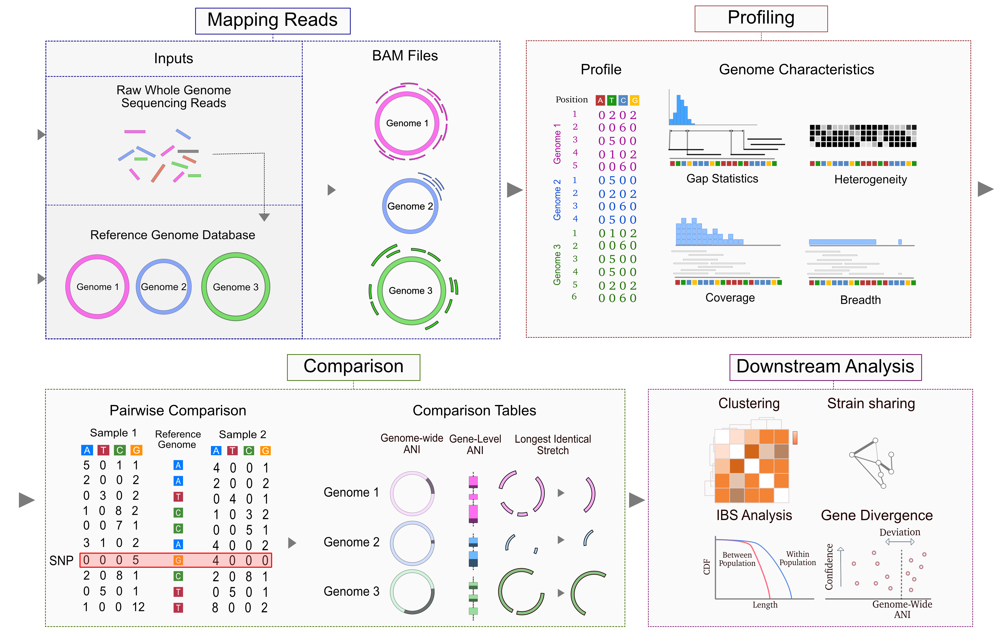

# Quick Start
  


ZipStrain provides a full workflow for strain-level metagenomic analysis:

- Profile BAM files into nucleotide-resolution A/C/G/T count tables
- Generate companion genome and gene coverage summaries during profiling
- Compare samples with popANI, conANI, cosANI, IBS, and identical-gene metrics
- Run pairwise comparisons with Polars or DuckDB engines
- Scale out with resumable local or Slurm-backed task execution
- Run end-to-end Nextflow pipelines from local reads or SRA accessions
- Build reference bundles directly from Sylph abundance tables
- Use the CLI for production workflows or the Python API for custom analysis

## Installation

Install from PyPI:

```bash
pip install zipstrain
zipstrain --version
zipstrain test
```

ZipStrain requires Python 3.12+.
If you install with `pip`, install `samtools` separately.
If you plan to use the matrix-store workflow from pip, install the optional matrix dependencies with `pip install "zipstrain[matrix]"`.

Other supported installation paths:

- Conda: `conda install -c conda-forge -c bioconda -c defaults zipstrain`
- Docker: `docker run -it parsaghadermazi/zipstrain:<version> zipstrain test`
- Apptainer: `apptainer run docker://parsaghadermazi/zipstrain:<version> zipstrain test`

More details: [Installation Guide](installation.md)

## Command Layout

| Command | Purpose |
| --- | --- |
| `zipstrain profile` | Batch-profile multiple BAM files |
| `zipstrain compare genomes` | Batch genome-level comparisons |
| `zipstrain compare genes` | Batch gene-level comparisons |
| `zipstrain utilities ...` | Single-sample tools, preparation helpers, format conversion, and database builders |
| `zipstrain test` | Validate the local installation |

## Quick Start

### 1. Prepare profiling assets

```bash
zipstrain utilities prepare_profiling \
  --reference-fasta reference_genomes.fna \
  --gene-fasta reference_genomes_gene.fasta \
  --stb-file reference_genomes.stb \
  --output-dir profiling_assets
```

`prepare_profiling` writes `null_model.parquet`, `genomes_bed_file.bed`, `gene_range_table.tsv`, and `genome_lengths.parquet` into `profiling_assets`.

### 2. Profile BAM files in batch

`samples.csv` must contain `sample_name` and `bamfile` columns.

```bash
zipstrain profile \
  --input-table samples.csv \
  --stb-file reference_genomes.stb \
  --null-model profiling_assets/null_model.parquet \
  --gene-range-table profiling_assets/gene_range_table.tsv \
  --bed-file profiling_assets/genomes_bed_file.bed \
  --genome-length-file profiling_assets/genome_lengths.parquet \
  --run-dir profile_run
```

If you also pass `--reference-fasta`, each profile gains `ref_base_bitmask` and the companion gene/genome stat tables gain `ref_ani`.

### 3. Build a profile DB

Create a CSV with header `profile_name,profile_location`, then build the profile DB:

```bash
zipstrain utilities build-profile-db \
  --profile-db-csv profiles.csv \
  --output-file profile_db.parquet
```

### 4. Run genome comparisons

Launch batched genome comparisons from the profile DB:

```bash
zipstrain compare genomes \
  --profile-db profile_db.parquet \
  --scope all \
  --stb-file reference_genomes.stb \
  --run-dir genome_compare_run \
  --calculate all
```

For ANI-only runs:

```bash
zipstrain compare genomes \
  --profile-db profile_db.parquet \
  --scope all \
  --stb-file reference_genomes.stb \
  --run-dir genome_compare_run \
  --calculate ani
```

Set `--engine duckdb` to switch the genome-compare backend from the default Polars engine.

Single-pair helpers and table builders live under `zipstrain utilities`.
The full command reference is linked below.

## Nextflow Workflows

ZipStrain ships with Nextflow workflows for:

- read mapping
- BAM profiling
- SRA-to-profile processing
- genome comparisons
- gene comparisons

Example:

```bash
nextflow run zipstrain.nf \
  --mode profile \
  --input_table bams.csv \
  --reference_genome reference_genomes.fna \
  --gene_file reference_genomes_gene.fasta \
  --stb reference_genomes.stb \
  --output_dir out_profile \
  -c conf.config \
  -profile docker \
  -resume
```

See: [Nextflow Pipeline Guide](https://OlmLab.github.io/ZipStrain/NextflowPipeline/)#